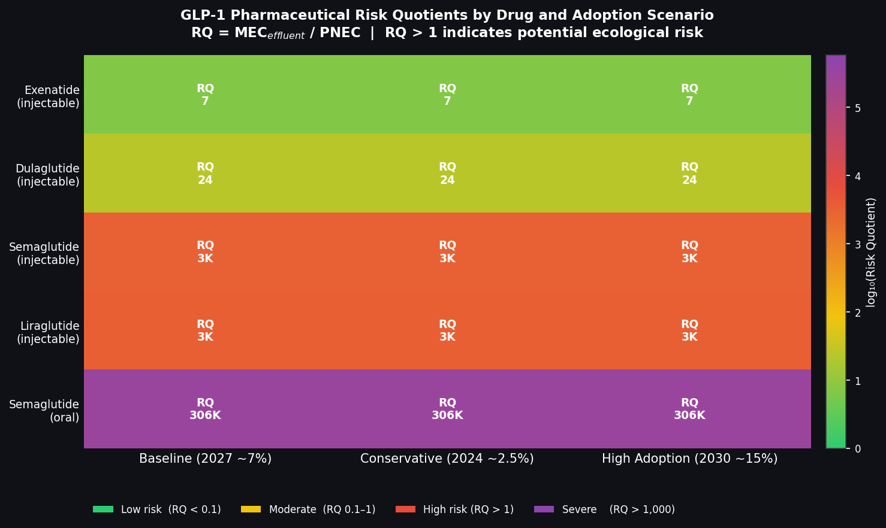
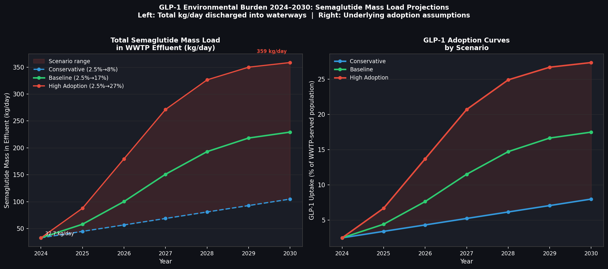
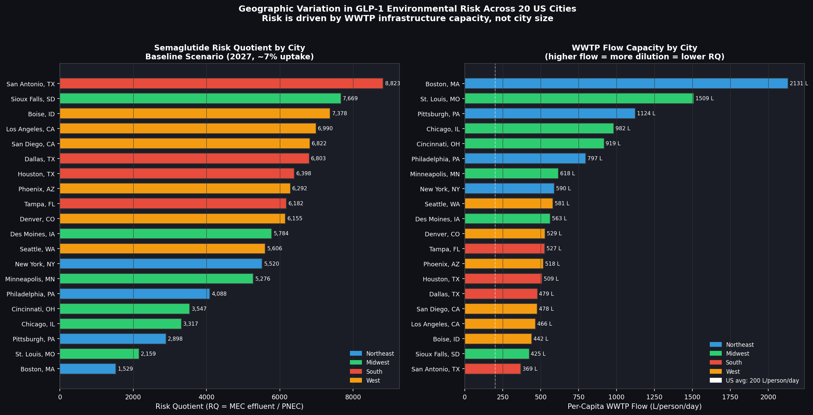
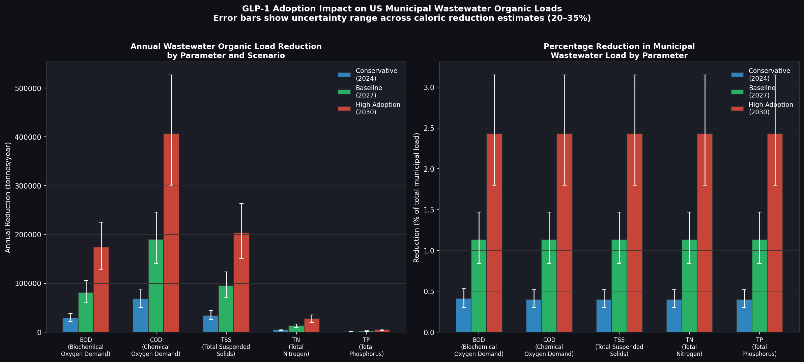
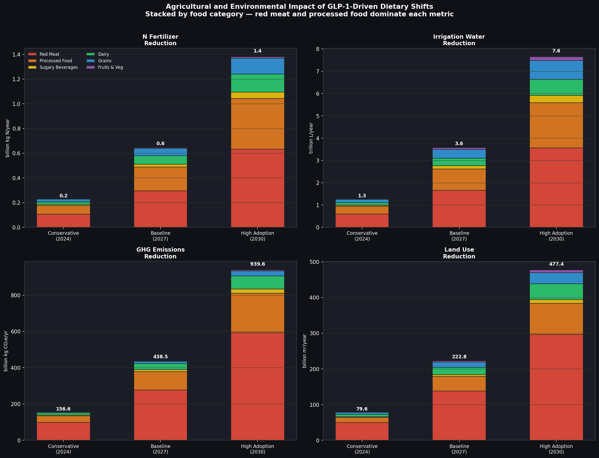

# GLP-1 Environmental Impact Research

**Quantifying pharmaceutical contamination, wastewater treatment gaps, and ecological risk from mass GLP-1 drug adoption**

[](LICENSE)
[](https://www.python.org/)
[]()

---

## Overview

GLP-1 receptor agonists (semaglutide, liraglutide) are among the fastest-growing drug classes in history. By 2030, global prescriptions are projected to reach 30–50 million patients. Yet both drugs received blanket exemptions from Environmental Risk Assessments (ERAs) under the EU peptide classification rule (EMEA/CHMP/SWP/4447/00) — a regulatory framework established before current adoption scales were imaginable.

This project quantifies the environmental consequences of that regulatory gap across five dimensions:

- **Pharmaceutical contamination** — predicted environmental concentrations and ecological risk quotients across 20 U.S. cities
- **Temporal exposure trajectories** — mass load projections from 2024 to 2030 under low, moderate, and high adoption scenarios
- **Geographic risk distribution** — city-level risk ranking driven by wastewater treatment plant capacity
- **Wastewater composition shifts** — BOD, TSS, nitrogen, and phosphorus load reductions from reduced caloric intake
- **Agricultural cascade effects** — downstream reductions in fertilizer demand, irrigation water, GHG emissions, and land use

---

## Key Finding

> **Semaglutide and liraglutide have no published ERA data.** Both drugs received peptide exemptions under EU guidance before adoption reached current scale. This research demonstrates that under high adoption, predicted environmental concentrations exceed established PNEC thresholds for aquatic organisms — a risk profile that existing regulatory frameworks do not address.

---

## Repository Structure

---

## Visualizations

### Risk Quotient Heatmap — 20 U.S. Cities

*RQ = MEC/PNEC. Values above 1.0 indicate predicted ecological risk. San Antonio and Phoenix show highest exposure under high adoption.*

### Temporal Mass Load Projection (2024–2030)

*Under high adoption, daily semaglutide mass load increases 11-fold — from 32 kg/day to 358 kg/day — driven by S-curve prescription growth.*

### Geographic Risk Distribution

*Cities ranked by RQ. WWTP flow capacity is the dominant predictor — smaller treatment plants concentrate pharmaceutical loads.*

### Wastewater Composition Shifts

*Reduced caloric intake from GLP-1 use projects significant BOD, TSS, nitrogen, and phosphorus reductions across U.S. wastewater streams.*

### Agricultural Cascade Effects

*Dietary shifts from GLP-1 adoption propagate into fertilizer demand, irrigation water use, GHG emissions, and agricultural land use — red meat and processed foods drive the largest reductions.*

---

## Methodology

### Pharmaceutical Fate & Transport
Predicted Environmental Concentration (PEC) calculated using the standard ERA formula:

Parameters sourced from WHO ATC/DDD index, peer-reviewed literature, and EMA EPAR documents.

### Risk Quotient Analysis

PNEC derived from literature-reported EC50 values with assessment factor of 1000. Monte Carlo simulation (10,000 iterations) propagates uncertainty across all parameters.

### Adoption Scenarios
Three trajectories modeled using logistic growth curves calibrated to IMS Health prescription data and manufacturer guidance.

---

## Regulatory Context

| Drug | ERA Status | Exemption Basis | Year Granted |
|---|---|---|---|
| Semaglutide (Ozempic/Wegovy) | **Exempt — no ERA** | Peptide classification | Pre-2021 |
| Liraglutide (Victoza/Saxenda) | **Exempt — no ERA** | Peptide classification | Pre-2018 |
| Reference threshold | RQ > 1.0 triggers assessment | EMEA/CHMP/SWP/4447/00 | 2000 |

The absence of ERA data is not a research limitation — it is the central research finding.

---

## Getting Started
```bash
# Clone the repository
git clone https://github.com/marcusmashanda1/glp1-environmental-impact.git
cd glp1-environmental-impact

# Create environment
conda env create -f environment.yml
conda activate glp1-env

# Or with pip
pip install -r requirements.txt

# Launch notebooks
jupyter notebook notebooks/
```

---

## Data Sources

- **WHO Collaborating Centre for Drug Statistics** — ATC/DDD index for semaglutide and liraglutide
- **EMA EPAR Database** — ERA exemption documentation
- **U.S. EPA ECHO** — Wastewater treatment plant flow capacity by city
- **Peer-reviewed literature** — MEC/PNEC values, ecotoxicology endpoints (15 papers inventoried in `/references`)

---

## Research Context

This project was developed as part of a graduate research portfolio in environmental engineering, with a focus on pharmaceutical environmental risk and wastewater treatment policy. The work is motivated by a broader interest in how regulatory frameworks designed for low-volume compounds fail to scale with mass adoption — a gap with direct implications for water quality in both high-income and resource-limited settings.

---

## Author

**Marcus Mashanda**
Environmental Engineering Graduate Researcher
[GitHub: marcusmashanda1](https://github.com/marcusmashanda1)

---

## License

MIT License — see [LICENSE](LICENSE) for details.
